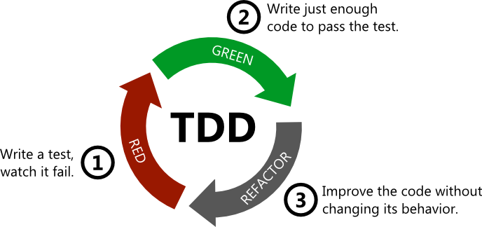

# How to solve any problem? (Get used to `fast tests` & TDD)

> Please tell me about the last `bug` you had in your code? What was the problem and how much time/money it cost to you/company to fix it?

> Are `tests` required in your workplace? Do you write them? Do you like writing them?

- [The Three Laws of TDD / Robert Martin @youtube.com](https://www.youtube.com/watch?v=qkblc5WRn-U)
- [Unit Test @martinfowler.com](https://martinfowler.com/bliki/UnitTest.html)
- [Test Driven Development @martinfowler.com](https://martinfowler.com/bliki/TestDrivenDevelopment.html)

In essence you follow three simple steps repeatedly:

- Write a test for the next bit of functionality you want to add.
- Write the functional code until the test passes.
- Refactor both new and old code to make it well structured.

## Practical tasks

### Easy

- [Account statement](./exercises/account-statement.md)
- [Roman numbers](./exercises/roman-numbers.md)
- [Score keeper](./exercises/score-keeper.md)
- [Metric converter](./exercises/metric-converter.md)
- [Tic Tac Toe](./exercises/tic-tac-toe.md)
- [URL shortener](./exercises/url-shortener.md)
- [ohce](./exercises/ohce.md)

### Medium

- [Bowling game](./exercises/bowling-game.md)
- [Change maker](./exercises/change-maker.md)
- [Mars rover](./exercises/mars-rover.md)
- [Timesheet calculator](./exercises/timesheet-calculator.md)

### Hard

- [Poker hands](./exercises/poker-hands.md)
- [Robot factory](./exercises/robot-factory.md)

## Home assignments

- [Wordle](https://www.nytimes.com/games/wordle/index.html) + autosolve as a bonus
- [Pipes](https://www.puzzle-pipes.com/) + autosolve as a bonus
- [2048](https://play2048.co/) + autosolve as a bonus
